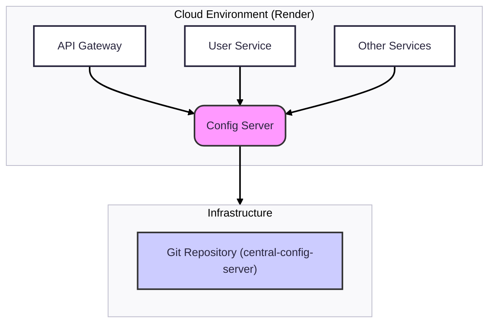

# BookTicket :: Platform :: Config Server

## Overview

The **Config Server** is a foundational component of the BookTicket microservices ecosystem. It provides centralized, externalized configuration management for all services. By acting as a single source of truth, it ensures that all microservices run with consistent and correct properties across different deployment environments.

This service uses Spring Cloud Config Server.

## Core Responsibilities

-   **Centralized Configuration:** Serves configuration properties to all other microservices from a central location.
-   **Environment Abstraction:** Manages different configuration profiles (e.g., `dev`, `prod`) for each service.
-   **Versioning and Auditing:** Leverages a Git backend to provide a complete history of all configuration changes.

## Architecture

### How It Works

1.  **Backend Storage:** All configuration files (`.yaml`) are stored in a dedicated Git repository. This provides version control, history, and an auditable trail for every configuration change.
2.  **Client Bootstrap:** When a microservice (e.g., `user-service`) starts up, it makes a request to the Config Server, identifying itself by its application name and active profile (e.g., `user-service`, `prod`).
3.  **Serving Configuration:** The Config Server reads the appropriate files from the Git repository (`application.yaml` and `user-service-prod.yaml`), combines the properties, and sends them back to the client service.
4.  **Standalone Operation:** The Config Server is a foundational service and does **not** register with the Eureka Service Registry. This is a deliberate design choice to prevent circular dependencies during application startup.

## Configuration

The server is configured in its `application.yaml` file. Key properties include:

-   `spring.cloud.config.server.git.uri`: The URI of the Git repository containing the configuration files.
-   `server.port`: The port on which the Config Server listens (default: `8888`).
-   `eureka.client.enabled: false`: Explicitly disables Eureka client behavior.
-   `spring.cloud.config.enabled: false`: Prevents the server from trying to connect to itself for configuration.

## Endpoints

The Config Server exposes a REST API for clients to fetch their configuration. You can inspect the configuration for a service using the following URL structure:

`/{application}/{profile}`

-   **Example:** To see the production configuration for the `api-gateway`, you would access:
    `https://config-server-f2t3.onrender.com/api-gateway/prod`
